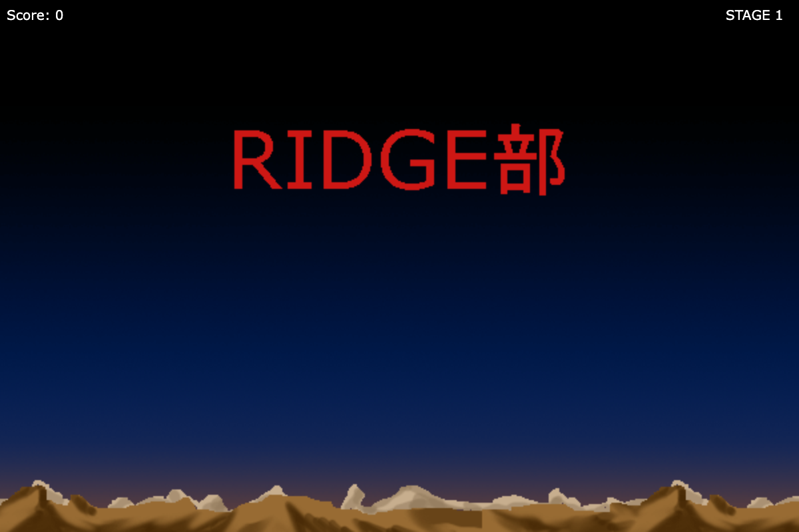
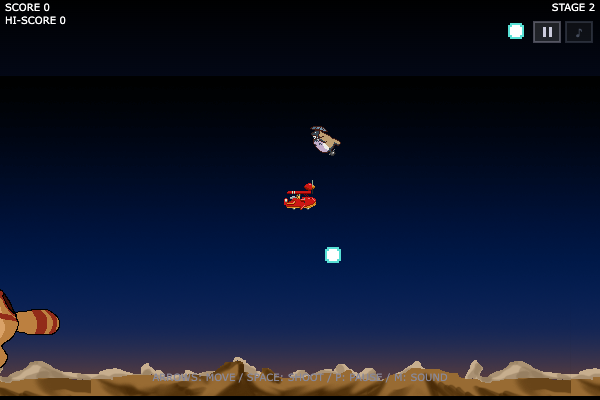
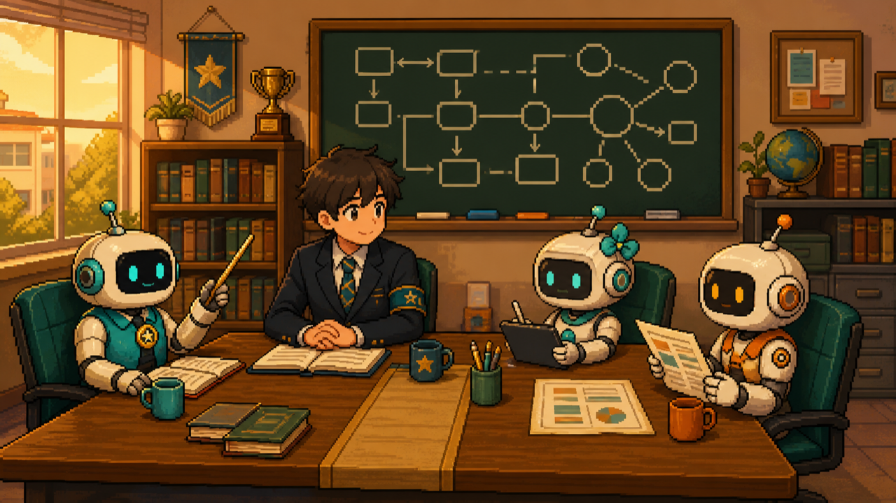

<!-- _class: lead -->
<!-- _paginate: false -->

# 十数年前の自作ゲームを、 AIと蘇らせた話

## — 生徒会駆動開発のすすめ —

<!-- 発表10分。前半3枚が物語(a)、4枚目以降がプロセス(b)。 -->

---

# 発端: 古いフォルダから発掘された `1/index.html`

- 十数年前、**友人と2人**で作ったブラウザシューティング
  - 私: プログラム / 友人: **ドット絵**(アニメGIF 33本)
- 技術は当時流行りの **DHTML**(JS でスプライトの div を動かす)
- ふと思った——「これ、今のブラウザで動くのか?」
- **動いた。** ここから全てが始まった

<!-- つかみ。「実家から卒業アルバムが出てきた」的な話として。 -->

---

# 何をしたか: 「保存」と「進化」の2本立て

- **旧作(classic)**: ゲームの挙動は当時のまま、
  コードだけ現代化
  - 全26回のリファクタ——ESM / Lint / 型 / テスト / CI
  - **勝てないバグ(勝利処理の配線忘れ)も
    仕様として保存**
- **新版**: 自作 canvas エンジンで作り直し、
  新機能を積む
- どちらも GitHub Pages で**公開中(遊べます)**

<!-- 右は旧作の実画面。「勝てないまま保存」で一笑い取れる。 -->

---

# 凍結の思想: 「直す」と「変える」を混ぜない

- 旧作は**凍結**——思い出は上書きしない
- 変えたいことは全部**新版へ**
- 新版も完成したら凍結し、次の版を作る
  ——**系譜で保存する**
- サービスが死んでもゲームは残る。
  **凍結は最強の保存**

<!-- 右は新版のボス戦(友人のドット絵の見せ場)。 -->

---

# 本題: AIとどう作ったか

## 「生徒会駆動開発」

- AI協働の運用規則を、**学校のメタファー**で固定した
- 会長(人間・意思決定)
- 顧問・書記(AI・実装と記録)
- 外部顧問(別会社のAI・レビュー)
- 委員(軽量AI・並列調査)

> メタファーは飾りではなく、**手続きの名前**になる

<!-- 右のイラストも別AIに発注して生成したもの(後で回収)。 -->

---

# 授業: リファクタ26回を「教師」にやらせる

- 頼み方を変えた:
  「**プログラマーになりたての昔の自分に教える教師として**説明して」
- 効果:
  - 変更の**理由**が毎回文書に残る(1授業=1コミット+1教材)
  - 提案の粒度が「生徒がついてこられる大きさ」に揃う
- 26回の授業記録は、のちに**全部が資料**になった
  (今日のスライドの原稿も、この記録から書き起こしたもの)

---

# 生徒会: 新機能はぜんぶ議事にする

| GitHub | 生徒会 |
| ------ | ------ |
| Issue | 議題の提出 |
| Issue コメント | 質疑応答(会長レビュー) |
| Pull Request | 審議(CI が会計監査) |
| **マージ前の実プレイ** | **試遊(受け入れテスト)** |
| マージ | 決議・可決 |
| docs/ の議事録 | 書記の記録(却下案も残す) |

> CI が緑 = 「壊れていない」証明。**「面白い」の証明は人間の試遊だけ**

---

# 質疑応答の記録: 人は喋るだけ、AIが清書する

- 会長(私)は開発セッションで**口頭で答えるだけ**
- 書記(AI)がそれを整理して Issue に「質疑応答の記録」として残す
- 決定の**理由**と**却下した案**まで全部残る
- GitHub アカウントが1つでも破綻しない
  ——すべてのコメントは「書記の筆」だから

> 記録係をAIにすると、**意思決定ログがタダで貯まる**

---

# 職員室: AIモデルの役割分担

| 役職 | 担当 | 狙い |
| ---- | ---- | ---- |
| 常勤顧問(高性能モデル) | 設計・実装・記録 | 品質の主柱 |
| 外部顧問(別会社のAI) | レビュー専任・読み取り専用 | **別の目**+別枠の課金 |
| 委員(軽量モデル) | 並列の調査・棚卸し | 安く速く |

- 学び: 最大のコストレバーは**セッションの基本モデル**
- 細かすぎる分業は、文脈の読み直しコストで逆に損

---

# 外部顧問の実績: 「別の目」は本当に効く

- 大掃除(総点検の行事)で、外部顧問が **11件を指摘**
- うち**2件は、人間と常勤AIの両方が見落としていた実害バグ**
  - 同一フレーム多段ヒットでスコアが二重加算
  - 当たり判定が画像の 1/4 しかなく、実質当たらない攻撃
- コストは別サービスの契約枠——**主開発の予算を消費しない**

> AIも見落とす。ただし**別のAIは別の見落とし方をする**

---

# 試遊駆動チューニング: デモAIに「人格」が宿るまで

- タイトル放置で始まるデモプレイ(ルールベースAI)を、
  会長の**試遊 → 観察の言語化 → 修正**で6往復
- 「小刻みで人間離れ」→ **判断間隔** 0.2秒
- 「進んで戻ってを繰り返す」→ **引き返しの禁止**
- 「余裕がある時ほど往復する」→ **警戒の間合い**(境界の振り子の解消)
- 人間の仕事は「現象の観察」。機構への翻訳と修正はAIが速い

---

# 失敗談(いちばん学びがあったところ)

- **誤診断**: スマホで全画面化が効かない → HTTPS が原因と仮説
  → 検証用の自己署名HTTPSサーバーまで立てて**空振り**
  → 真因は「pointerdown はユーザー操作と見なされない」というブラウザ仕様
- **CI の時間の希釈**: 混んだ CI ではゲーム内時間が壁時計より遅く流れ、
  「N秒待てば起きるはず」のテストが運負けする
- **年数の記憶違い**: AIが「20年前」と書き続けていた。実際は十数年前
  ——**それらしい数字ほど、人間が校閲するべき**

---

# 学んだこと

1. **メタファーは運用規則になる**
   ——「試遊」「議事録」「大掃除」に名前が付くと、人もAIも迷わない
2. **記録が資産になる**
   ——議事録10本+授業26回 → 発表資料の原稿が「もう書いてあった」
3. **人間の仕事は観察と裁定に寄っていく**
   ——手を動かす量ではなく、「何かおかしい」と言える解像度が価値になる

---

# オチ: この資料も、その体制で作られています

- 原稿: **書記(AI)** が議事録から書き起こし(Marp / Markdown)
- 画像: **大道具係(別AIの画像生成)** に発注
  ——表紙の飛行機も、生徒会室のイラストも
- レビュー: **外部顧問**、最終判断とリハーサル: **会長(人間)**
- スライドも PR で審議して、CI を通ってからマージされました

---

<!-- _class: lead -->

# 遊べます

## github.com/shg25/diggy2

### shg25.github.io/diggy2

旧作(勝てません)と新版(勝てます)、どちらも公開中
タイトル画面で15秒待つと、AIがデモプレイを始めます

<!-- 質疑応答へ。実機デモできる環境なら新版タイトルを開いておく。 -->
